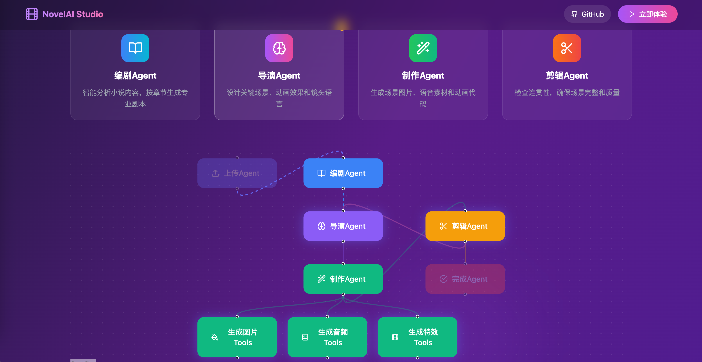

# Novel Animation Interactive Display System

An AI-powered novel animation generation and display system that automatically converts text novels into exquisite animated scenes.

[中文文档](README-zh.md)

online demo: https://w3pua.com/tool/noval/



## System Features

### 🎬 AI-Driven Creation Workflow
- **Screenwriter Agent**: Intelligently analyzes novels and generates scripts by chapters
- **Director Agent**: Designs key scenes, animation effects, and shot composition
- **Production Agent**: Generates image, voice, and animation assets
- **Editor Agent**: Checks coherence and ensures quality

### 🎨 Stunning Visual Effects
- AI-based scene image generation
- Smooth CSS animation effects
- Responsive design for all devices
- Modern user interface

### 🎵 Multimedia Experience
- Text-to-speech functionality
- Background music and sound effects
- Immersive visual experience
- Auto-play and manual controls

## Technical Architecture

### Frontend (React + TypeScript)
- **Framework**: React 18 + TypeScript
- **Styling**: Tailwind CSS
- **Icons**: Lucide React
- **Build**: Vite

### Backend (Python + FastAPI)
- **Framework**: FastAPI
- **AI Workflow**: LangGraph
- **Large Models**: Ollama (Llama 3.1)
- **Data Validation**: Pydantic
- **Asynchronous Processing**: asyncio

### AI Models
- **Text Generation**: Llama 3.1 8B
- **Image Generation**: Supports multiple AI image APIs
- **Speech Synthesis**: TTS service integration
- **Animation Generation**: AI-assisted CSS animation

## Quick Start

### Environment Requirements
- Node.js >= 18
- Python >= 3.8
- Ollama service

### 1. Clone the Project
```bash
git clone https://github.com/chalecao/noval-film-maker.git
cd novel-film-maker
```

### 2. install frontend dependencies
```bash
npm install
```

### 3. install backend dependencies
```bash
cd backend
pip install -r requirements.txt
```

### 4. start ollama server
```bash
# install Ollama
curl -fsSL https://ollama.com/install.sh | sh

# start 
ollama serve

# pull model
ollama pull gemma3n:e4b
```

### 5. start app
```bash
# start backend in terminal 1
cd backend
python run.py

# start front in termainal 2
npm run dev
```

### 6. visit local site
open in Chrome browser: http://localhost:5173

## Usage 

### upload noval txt
1. Click the upload area to select a novel file in TXT format
2. The file should contain clear chapter separations
3. Recommended file size within 1MB

### Processing Workflow
1. **Chapter Segmentation**: Automatically identify and split chapters
2. **Script Creation**: AI analyzes content to generate scripts
3. **Scene Design**: Design visual effects and animations
4. **Asset Generation**: Generate images, voice, and animations
5. **Quality Check**: Ensure coherence and completeness

### Playback Controls
- Auto-play all scenes
- Manual play/pause control
- Jump to specific chapters and scenes
- Adjust playback speed

## Project Structure

```
novel-animation-system/
├── src/                    # Frontend
│   ├── App.tsx            # Main Application Component
│   ├── components/        # UI Components
│   └── utils/            # Utility Functions
├── backend/              # Backend Source Code
│   ├── main.py           # FastAPI Application
│   ├── agents/           # AI Agent Implementations
│   ├── utils/            # Utility Functions
│   └── models.py         # Data Models
├── public/               # Static Resources
└── docs/                 # Documentation
```

## Functional Features 

### Implemented Features
- ✅ Text novel upload and processing
- ✅ Chapter segmentation
- ✅ AI script generation
- ✅ Scene design and animation
- ✅ Multimedia playback interface
- ✅ Responsive design

### Planned Features
- 🔄 Advanced image generation integration
- 🔄 Background music generation
- 🔄 User-customizable styles
- 🔄 Export to video format
- 🔄 Community sharing functionality

## Contribution Guidelines

Welcome to contribute code! Please view [CONTRIBUTING.md](CONTRIBUTING.md) for more details.

### Development Process
1. Fork the project
2. Create a feature branch
3. Commit your changes
4. Push to your fork
5. Create a Pull Request

### Code Guidelines
- Use TypeScript for type checking
- Follow ESLint configuration
- Write test cases
- Update documentation

## License

This project is licensed under the MIT License. See [LICENSE](LICENSE) for more details.

## Support

If you encounter any problems or have suggestions, please:  
1. Check [FAQ](docs/FAQ.md)
2. Submit [Issue](https://github.com/chalecao/noval-film-maker/issues)
3. Contact development team

## Acknowledgements

Thank you to the following open-source projects for their support:
- [React](https://reactjs.org/)
- [FastAPI](https://fastapi.tiangolo.com/)
- [LangGraph](https://langchain-ai.github.io/langgraph/)
- [Ollama](https://ollama.com/)
- [Tailwind CSS](https://tailwindcss.com/)
- [pyttsx3](https://pyttsx3.readthedocs.io/en/latest/)
- [pydub](https://github.com/jiaaro/pydub)
- [ffmpeg](https://ffmpeg.org/) 
- [ffmpeg-python](https://github.com/kkroening/ffmpeg-python)
- [diffusers](https://huggingface.co/docs/diffusers/index)
- [torch](https://pytorch.org/)
